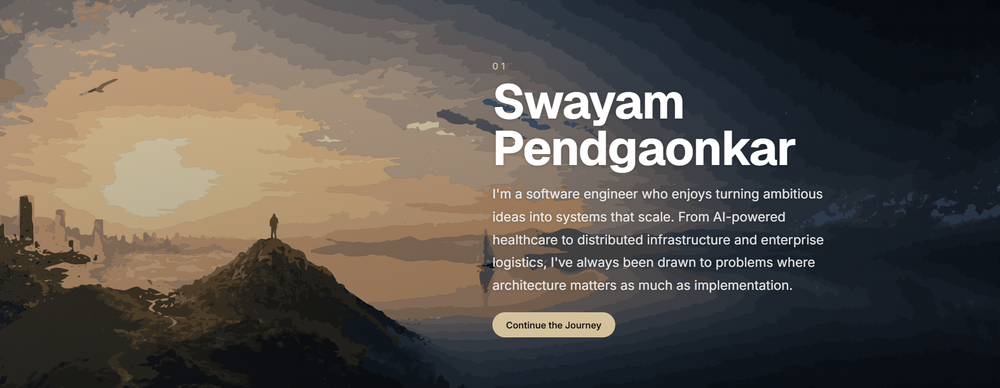

---

### `$ whoami`

Software Engineer building production backend systems and cost-efficient LLM infrastructure. I work across the stack — from backend services processing millions of records, to RAG pipelines and agentic AI workflows, to the cloud architecture underneath all of it.

- 🔭 **Currently building:** `distill` — a drop-in LLM gateway that cuts token spend via prompt compression, semantic caching, and dynamic model routing.
- 🧠 **Also prototyping:** **VEDA** — real-time computer-vision object detection driving a tactile Braille display for the visually impaired. → [vedaatech.com](https://vedaatech.com)
- ⚙️ **Day to day:** backend systems, distributed systems, cloud architecture, RAG pipelines, production reliability (testing, incident response, hypercare).
- 🎓 B.Tech Computer Science, Symbiosis Institute of Technology — exchange semester at TUHH, Hamburg.
- 📫 Reach me on [LinkedIn](https://www.linkedin.com/in/skp2208/) or **swayam.pendgaonkar@gmail.com**

---

### 🛠️ Tech Stack

**Languages**

    

**Backend & Systems**

    

**AI & LLM Infra**

    

**Data Stores & Messaging**

    

**Cloud & Infrastructure**

     

**Observability**

 

**Data & ML**

   

**Frontend**

   

---

### 📌 Highlighted Work

> **[`distill`](https://github.com/starrylight90/distill)** — a drop-in LLM gateway sitting between any app and any model provider. Prompt compression, exact + semantic caching (Redis + pgvector), and dynamic cost-aware model routing — with full token/cost observability. *(Active build)*

> **[`pulse`](https://github.com/starrylight90/pulse)** — a real-time chat system built to survive horizontal scaling: WebSockets + Redis Pub/Sub so messages route correctly across multiple backend instances, with JWT auth, rate limiting, and typing/presence indicators.

> **[`url-shortener`](https://github.com/starrylight90/url-shortener)** — a distributed URL shortener with Redis-backed caching and a Bloom filter in front of it to cut wasted lookups before they ever hit the database.

> **VEDA** — real-time object detection paired with a tactile Braille display, giving visually impaired users a physical sense of their surroundings. *(Active prototyping)* → [vedaatech.com](https://vedaatech.com)

---

### 🐍 Contribution Graph, Eaten Alive

  

---

### 📊 GitHub Stats

🏆 GitHub Trophies

 

---

### 😄 Random Dev Joke

  

